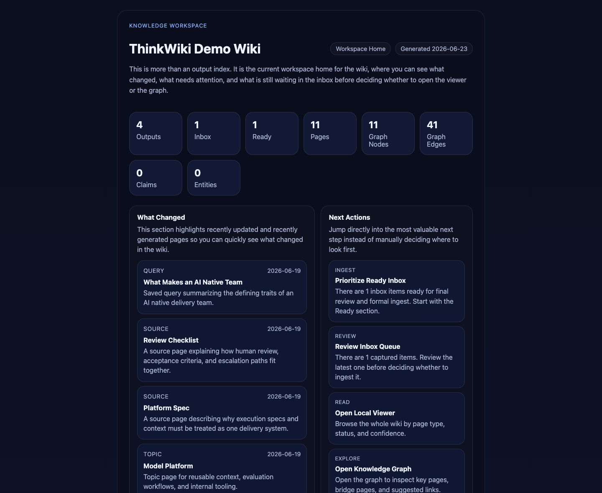
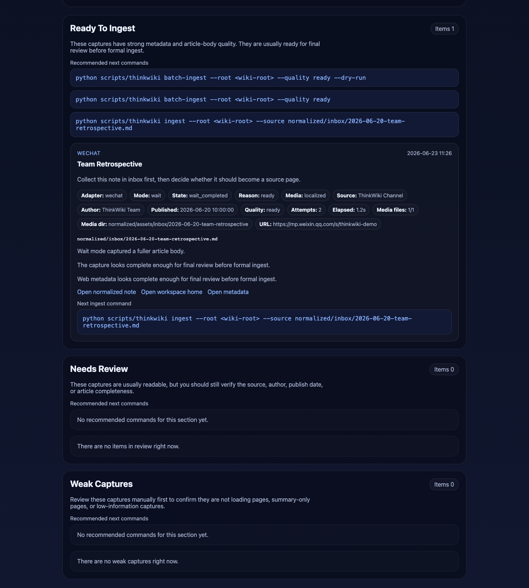
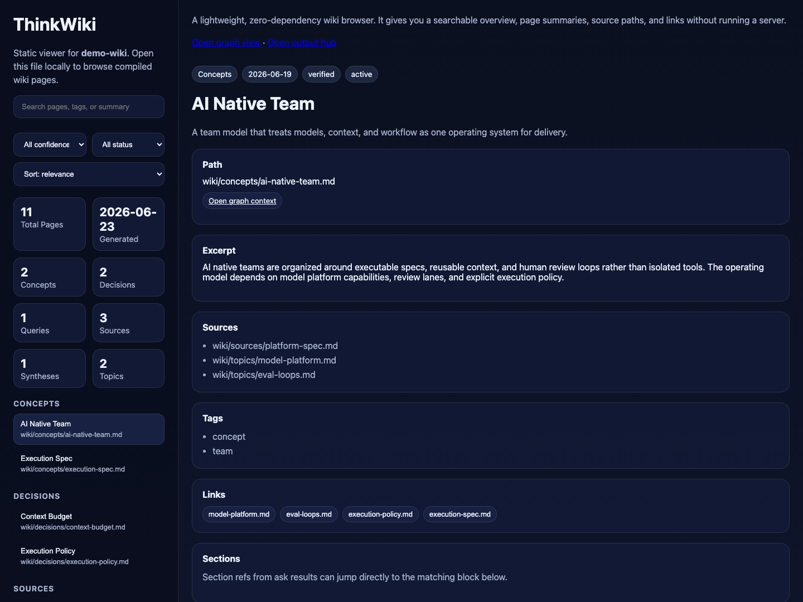
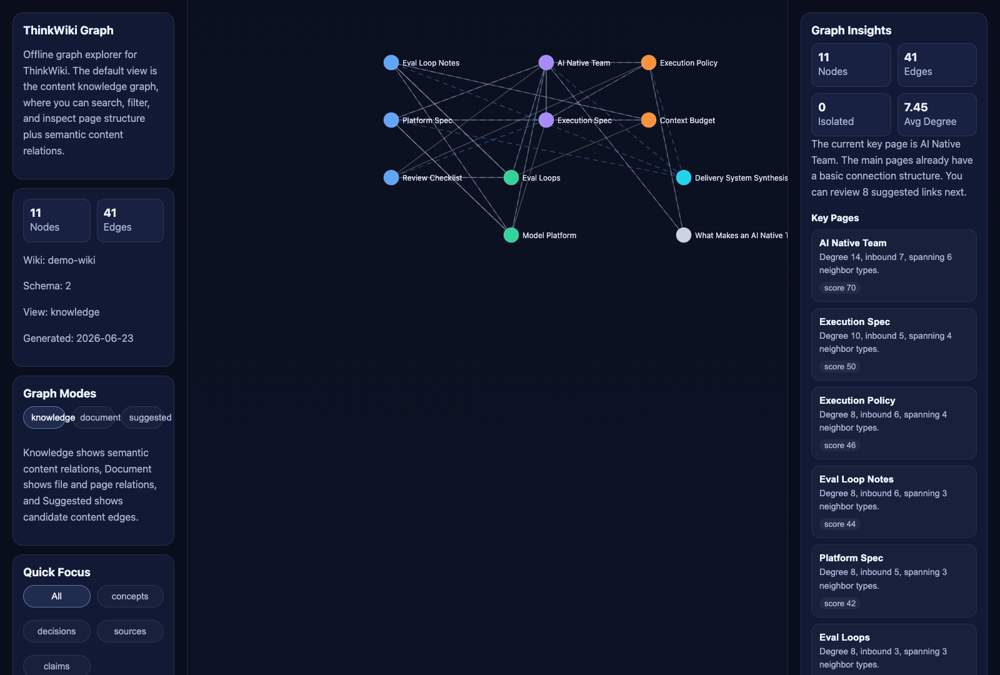
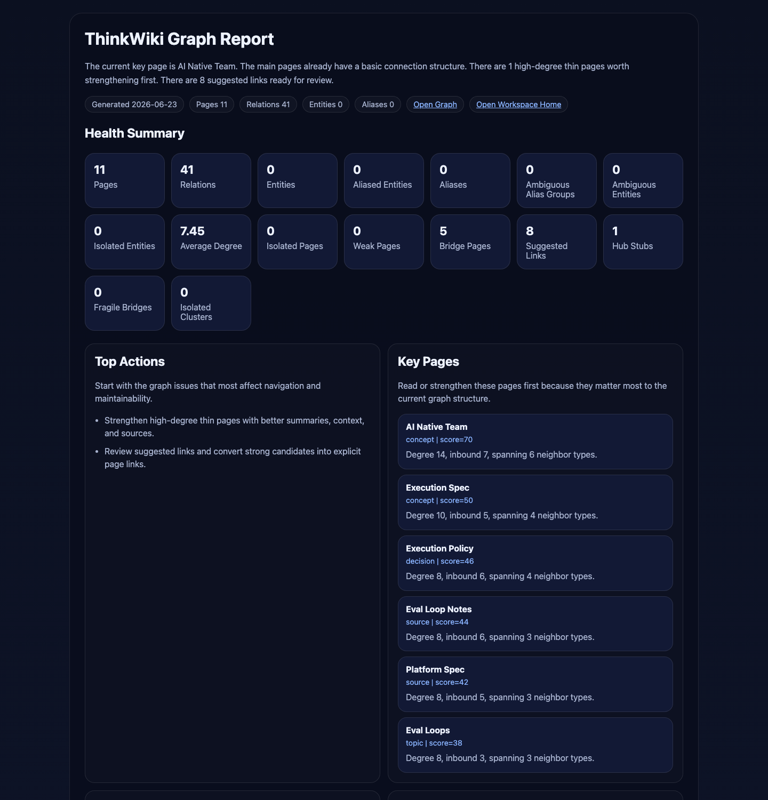

# ThinkWiki

[](https://github.com/wzdavid/ThinkWiki/releases)
[](LICENSE)
[](https://www.python.org/)

ThinkWiki 是一个 **面向 Agent 的本地知识库 Skill**。你只需要和 Agent 对话，就能把网页、文档、笔记和对话持续沉淀成可追溯的 Markdown 知识空间，并生成可在浏览器中打开的 Inbox、浏览页和内容知识图谱。

English version: [README.md](README.md)

代码库：**https://github.com/wzdavid/ThinkWiki**

## 适用于支持 Agent Skills 的智能体

ThinkWiki 遵循开放的 [Agent Skills](https://agentskills.io) 规范（`SKILL.md` + 脚本目录）。只要你的 Agent 能安装 Skill 并在本机执行命令，就可以使用 ThinkWiki。

你 **不需要记住 CLI 命令**。安装一次 Skill 之后，创建和管理知识库都可以通过对话完成。

| Agent / 宿主 | 典型用法 |
| --- | --- |
| [Claude Code](https://docs.anthropic.com/en/docs/claude-code) | 将仓库安装为 Skill，在对话中构建和查询知识库 |
| [OpenClaw](https://openclaw.ai) | 完整 Skill 工作流；可用 `serve` + 内置 browser 打开 HTML 成果页 |
| [Trae](https://www.trae.ai) | 安装到 `.trae/skills`，在对话中管理 wiki |
| [Hermes Agent](https://github.com/NousResearch/hermes-agent) | 本地 Skill 目录 + shell 执行 |
| [OpenAI Codex](https://developers.openai.com/codex) / Codex CLI | 支持 Skills 的本地编码 Agent |
| [Cursor](https://cursor.com) | Agent 模式 + 项目 Skill |
| [Gemini CLI](https://github.com/google-gemini/gemini-cli) | 支持 Skills 的 CLI Agent |
| [GitHub Copilot](https://github.com/features/copilot) | VS Code 中支持 Skills 的 Agent / 编码工作流 |
| 其他 Skills 宿主 | 只要能加载 `SKILL.md` 并在本机运行 `python3 scripts/thinkwiki ...` |

**前提：** 本机有 Python 3 环境。ThinkWiki 会在首次使用时自动 bootstrap 运行时。纯云端对话、无法访问本机文件或 shell 的环境无法运行本地知识库。

## 快速开始：用对话安装

把下面这个代码库地址发给你的 Agent，请它帮你安装并验证环境。

**示例说法：**

> 请帮我安装 ThinkWiki 这个 Skill，代码库地址是 https://github.com/wzdavid/ThinkWiki ，完成 bootstrap 并检查一下本机环境是否可用。

Agent 通常会把 Skill 安装到宿主对应的 skills 目录，执行 `bootstrap` 和 `doctor` 做自检。一般情况下你不必自己敲这些命令，除非你希望手动安装。

**安装完成后，直接开始用：**

> 帮我在工作区创建一个名为 `My Wiki` 的本地知识库。

> 先把这篇文章收进 inbox：`https://example.com/article`

> 把这个 PDF 导入知识库：`/path/to/file.pdf`

> 根据我的 wiki 回答：我们之前对 context budget 做过什么决定？

> 生成知识图谱，并在浏览器里打开工作台首页。

Agent 会读取 `SKILL.md`，把你的意图映射成稳定的 ThinkWiki 动作，并告诉你 Markdown 页面和 HTML 成果页的位置。

## 为什么用 ThinkWiki

- **Agent-first：** 用户主要通过和 Agent 对话来使用，不需要记很多命令。
- **Local-first：** Markdown 文件仍然是真相源，数据留在本机。
- **HTML-first：** Inbox、Viewer、Graph、Governance 都是可浏览的真实工作界面。
- **Knowledge-first：** 图谱是内容知识图谱，而不只是文件链接图。

## 会生成什么

ThinkWiki 会生成这些核心成果页：

- `output/index.html`：统一工作台首页
- `output/inbox/index.html`：Inbox 复核页
- `output/viewer/index.html`：本地浏览页
- `output/graph/index.html`：交互式知识图谱页
- `output/graph/report.html`：图谱治理报告页
- `output/graph/entity-merge-review.html`：实体归并复核页
- `output/graph/entity-merge-plan.html`：实体归并 dry-run 预演页

### 界面预览

#### 工作台首页（`output/index.html`）

统一工作台首页，汇总最近变更、推荐下一步操作、Inbox 待办和图谱快照，方便你决定先阅读、入库还是进入图谱。



#### Inbox 复核页（`output/inbox/index.html`）

在正式 ingest 前复核已采集的网页、文件和笔记。条目按 `ready / review / weak` 分组，优先处理价值最高的内容。



#### 本地浏览页（`output/viewer/index.html`）

按页面类型、置信度和状态浏览整个 wiki，可直接在本地 HTML 工作区中打开任意页面阅读。



#### 知识图谱页（`output/graph/index.html`）

交互式内容知识图谱。可在 `knowledge / document / suggested` 三种视图间切换，查看语义关系和候选边。



#### 图谱治理报告（`output/graph/report.html`）

查看孤立页面、高连接薄页、脆弱桥接、建议补链和实体归并候选等图谱健康信号，再决定是否调整知识结构。



## 日常怎么说（自然语言对照）

安装 ThinkWiki 之后，最常见的用法就是直接说人话：

| 你可以说 | ThinkWiki 会做什么 |
| --- | --- |
| 创建一个叫 `Research Notes` 的知识库 | 初始化本地 wiki 工作区 |
| 把这篇 URL / 文件先收进 inbox | 采集内容，等待复核 |
| 把 ready 的 inbox 条目正式入库 | 生成 wiki 页面 |
| 我的 wiki 里关于 X 是怎么说的？ | 基于已有页面做证据优先问答 |
| 把这个回答保存成 query 页 | 沉淀高价值输出 |
| 帮我看看知识图谱 | 构建/刷新图谱 HTML |
| 复核 entity merge 候选 | 展示 alias 冲突，等待确认 |
| 在浏览器里打开 wiki 工作台 | 启动 `serve`，返回 `http://127.0.0.1:8765/index.html` |

## 核心能力

- 初始化本地 wiki 工作区
- 先采集到 inbox，再决定是否正式入库
- 导入 Markdown、PDF、DOCX、XLSX、XLS、PPTX、网页和文本
- 基于已有知识页做证据优先问答
- 沉淀 `query / synthesis / decision / concept` 页面
- 生成 `knowledge / document / suggested` 三种图谱视图
- 做 entity alias 冲突复核和确定性归并
- 检查运行环境、工作区状态和图谱治理状态

## 内容知识图谱

在 `v1.6.0` 中，ThinkWiki 默认生成 `schema v2` 的内容知识图谱，默认视图是 `knowledge`。

知识图谱里可以包含：

- `source`、`topic`、`concept`、`decision`、`synthesis`、`query`、`entity` 等页面节点
- 从结构化内容里抽取出的 `claim` 节点
- `about`、`belongs_to`、`depends_on`、`asserts`、`supports`、`contradicts`、`suggests_related_to` 等语义关系

因此它已经不是单纯的文件关系图，而是可以表达知识结构、证据结构和实体治理的内容图谱。

## 浏览 HTML 成果页

Agent 对话界面通常无法直接渲染 ThinkWiki 的 HTML 页面。需要查看 Inbox、Viewer、Graph 或治理报告时，可以直接对 Agent 说：

> 启动 ThinkWiki 的输出服务，并把工作台 URL 给我。

或自行运行：

```bash
python3 scripts/thinkwiki serve --root /path/to/my-wiki
```

默认会在 `http://127.0.0.1:8765/` 提供 `<wiki-root>/output/` 目录。建议从 `http://127.0.0.1:8765/index.html` 进入工作台首页。

在 **OpenClaw** 中，`serve` 启动后 Agent 也可以用内置 browser 打开：

```bash
openclaw browser --browser-profile openclaw open http://127.0.0.1:8765/index.html
```

在其他 Agent 上，用系统浏览器打开同一 URL，或使用宿主提供的 browser 工具即可。

如果只需要 URL 列表、不想启动常驻服务，可使用 `serve --print-urls`。

### 局域网 / 跨设备访问（手机、其他电脑、平板）

默认的 `serve` 只绑到 `127.0.0.1`，所以同一台机器以外的其他设备（手机、第二台电脑、平板等）都打不开。需要在局域网里让所有设备都能访问，对 Agent 说：

> 启动 ThinkWiki 输出服务，要让我的手机在同一 Wi-Fi 下也能打开。

底层实际跑的是：

```bash
python3 scripts/thinkwiki serve \
  --root /path/to/my-wiki \
  --host 0.0.0.0 \
  --port 8765 \
  --allow-lan \
  --verbose
```

启动后，用任何与服务器在同一网络的设备，浏览器打开下面这些 URL：

| 页面 | URL |
| --- | --- |
| 工作台首页 | `http://<服务器IP>:8765/index.html` |
| 知识图谱 | `http://<服务器IP>:8765/graph/index.html` |
| 本地页浏览 | `http://<服务器IP>:8765/viewer/index.html` |
| Inbox 审核 | `http://<服务器IP>:8765/inbox/index.html` |

`<服务器IP>` 填**该机器上任何一个 IPv4 地址**都行 —— `0.0.0.0` 监听意味着同一份 wiki 在所有网卡上同时可达。常见值：

- 物理局域网 IP，例如 `192.168.x.y` 或 `10.0.x.y`（客户端与服务器在同一 Wi-Fi / 有线网时用这个）。
- VPN / overlay / ZeroTier 之类的虚拟 IP，例如 `10.229.x.y` 或 `100.64.x.y`（客户端通过 VPN/ZeroTier 等私有网络连到服务器时用这个）。
- `127.0.0.1`（仅在服务器本机自己用）。

想知道具体有哪些 IP 可以用，直接问 Agent：

> 我能从哪些地址打开这个知识库？把 URL 都列给我。

或者自己查：

```bash
# Linux
ip -4 addr show | grep -E "inet " | grep -v 127.0.0.1
ss -tlnp | grep 8765
```

如果客户端 `ping <服务器IP>` 能通，但浏览器还是打不开，最常见的原因有三个：

- **服务器防火墙拦了入站 8765 端口**（比如 `ufw`、`firewalld`、或 `iptables` 默认拒绝 INPUT）。要么开端口，要么临时关防火墙试一下。
- **客户端和服务器在不同网段，且没有互通路由**（例如一个在 `192.168.1.x`、另一个在 `192.168.2.x`，中间没桥接）。如果有 VPN/ZeroTier，试试对应的 overlay IP；都不行就退回到 SSH 隧道。
- **URL 错写成 `https://...`** —— `serve` 只支持 HTTP，不支持 HTTPS。

最终兜底方案 —— 如果上述都搞不定，用 SSH 端口转发把服务"拉"到客户端本机，再在客户端浏览器打开 `http://127.0.0.1:8765/index.html`：

```bash
ssh -L 8765:127.0.0.1:8765 <用户名>@<服务器IP>
```

## 环境变量

远程 AI 功能**默认全部关闭**，按需配置即可。

### 内容生成（`crystallize`、`digest`）

需要**同时设置以下三个变量**。支持任意 OpenAI 兼容的 chat completions 服务（MiniMax、OpenAI、DeepSeek、本地 Ollama 等）。

| 变量 | 必需 | 用途 |
|------|------|------|
| `THINKWIKI_LLM_API_KEY` | 启用时必需 | LLM 服务商 API key |
| `THINKWIKI_LLM_BASE_URL` | 启用时必需 | Chat completions 地址，如 `https://api.openai.com/v1/chat/completions` |
| `THINKWIKI_LLM_MODEL` | 启用时必需 | 模型名，如 `gpt-4o-mini` 或 `MiniMax-M3` |
| `THINKWIKI_LLM_TEMPERATURE` | 否 | 可选温度覆盖 |

未完整配置 LLM 时，`crystallize` 和 `digest` 仅使用本地启发式算法。

### 实体嵌入（`entity-merge-review`、`graph-report`、`health`）

设置 `THINKWIKI_EMBED_API_KEY` 后启用。默认使用硅基流动 BGE-M3，可自行覆盖 endpoint 和模型。

| 变量 | 必需 | 用途 |
|------|------|------|
| `THINKWIKI_EMBED_API_KEY` | 启用时必需 | Embedding 服务商 API key |
| `THINKWIKI_EMBED_BASE_URL` | 否 | Embedding 地址，逗号分隔多个；默认 `https://api.siliconflow.cn/v1/embeddings` |
| `THINKWIKI_EMBED_MODEL` | 否 | Embedding 模型；默认 `BAAI/bge-m3` |

如需默认嵌入方案，可在 https://siliconflow.cn 免费注册 key。

## 手动安装（可选）

如果你希望自己安装，而不是让 Agent 代劳：

```bash
git clone https://github.com/wzdavid/ThinkWiki ThinkWiki
cd ThinkWiki
python3 scripts/thinkwiki bootstrap
python3 scripts/thinkwiki doctor --repo-root .
```

然后按你所用 Agent 的文档，把该目录安装到对应的 skills 目录中。

## CLI 参考（给 Agent 和进阶用户）

ThinkWiki 在底层保持一个统一入口，Agent 会在背后调用它：

```bash
python3 scripts/thinkwiki <command> [args]
```

常见命令：`init`、`clip`、`ingest`、`inbox`、`viewer`、`graph`、`graph-report`、`entity-merge-review`、`entity-merge-apply`、`serve`、`health`、`status`、`doctor`。

完整意图映射见 `SKILL.md`。

## 仓库文档

- `README.md`：英文项目总览
- `README.zh.md`：中文说明
- `SKILL.md`：面向 Agent 宿主的 skill 约定
- `CHANGELOG.md`：版本记录

## License

MIT
